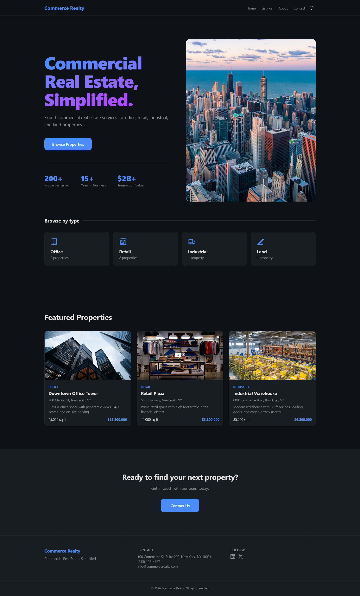

# Commerce Realty Lite

**The first commercial real estate theme for Astro 7 + Tailwind CSS v4.**

Stop hacking residential templates for office towers, retail plazas, and industrial warehouses. Commerce Realty Lite is purpose-built for brokerages, landlords, and CRE startups who need a fast, modern, SEO-ready site — without the bloat.

[](https://astro-commercial-real-estate-lite.pages.dev/)

---



## Why Commerce Realty?

There are 100+ Astro themes for residential real estate. Zero for commercial. If you sell, lease, or develop **office, retail, industrial, or land**, you've been stuck adapting a residential template that shows family photos and school ratings instead of sqft, zoning, and loading docks.

Commerce Realty changes that.

### Lite

A fully functional, production-ready CRE website. Deploy in 5 minutes.

---

## Features

### Lite

- **4 pages** — Home, Listings, About, Contact
- **Property detail pages** — SEO-optimized individual pages for each listing (`/listings/{slug}/`)
- **Type filter** — Click a property type to filter (Office, Retail, Industrial, Land)
- **Category links** — Browse by type from the homepage with URL-based filtering (`?type=Office`)
- **Dark mode** — System-aware default + manual toggle, persistent across pages with View Transitions
- **Mobile-first responsive** — Looks great on every screen size, from phone to ultrawide
- **Mobile bottom nav** — App-style tab bar for thumb-friendly navigation
- **Full SEO** — Per-page title, meta description, Open Graph tags, canonical URLs, sitemap-ready
- **Tailwind CSS v4** — CSS-first tokens, OKLCH color space, container queries
- **CSS scroll reveals** — Subtle entrance animations as you scroll (`animation-timeline: view()`)
- **View Transitions** — Smooth SPA-like navigation via Astro's `<ClientRouter />`
- **Split hero layout** — Text left, image right — modern 2026 design
- **Bento property grid** — Visual type selector with icons
- **Featured listings** — Spotlight up to 3 properties on the homepage
- **Netlify-ready contact form** — Add your Netlify form name and deploy
- **Agent profiles** — Meet-the-team section with headshots and bios
- **JSON data files** — All content in editable `site.json`, `listings.json`, `agents.json`, `stats.json` — no code changes needed
- **Zero JS framework** — No React, no Vue, no Svelte. Just vanilla JS where needed.
- **Favicon + robots.txt** — Included and configured
- **96 Lighthouse Performance** — Minimal JS, semantic HTML, optimized loading

## Tech Stack

| | |
|---|---|
| **Framework** | [Astro 7](https://astro.build) |
| **CSS** | [Tailwind CSS v4](https://tailwindcss.com) (CSS-first config, `@theme` tokens) |
| **Icons** | Heroicons (inline SVG) |
| **Images** | Unsplash (free stock photography) |
| **Deploy** | Netlify, Vercel, Cloudflare Pages, or any static host |
| **Dependencies** | `astro`, `@tailwindcss/vite`, `tailwindcss` — that's it |

---

## Quick Start

```bash
# Clone or download the theme
cd cre-lite

# Install dependencies
npm install

# Start the dev server
npm run dev
```

Open `http://localhost:4321` — you're live.

### Customize for your domain

Before deploying, update two files with your own URL:

- `astro.config.mjs` — change `site` to your domain
- `src/data/site.json` — change `url` to your domain

This ensures canonical URLs and Open Graph image paths point to your site.

### Edit your content

Edit the JSON files in `src/data/`:

```
src/data/
├── site.json        # Name, tagline, contact info, social links
├── listings.json    # Property data (title, type, address, price, image)
├── agents.json      # Team member profiles
└── stats.json       # Homepage statistics
```

That's it. No TypeScript files to dig through. No build steps for content changes.

### Build for production

```bash
npm run build
```

Output goes to `dist/` — deploy anywhere.

---

## Project Structure

```
src/
├── components/       # Reusable UI (Header, Footer, ListingCard, AgentCard, etc.)
├── data/             # JSON data files — edit these
├── layouts/          # BaseLayout with SEO, dark mode, View Transitions
├── pages/            # 10 generated pages (4 main + 6 listing details)
└── styles/           # global.css — Tailwind v4 theme tokens + utilities
```

---

## Design Philosophy

Commerce Realty was built for **2026 standards**:

- **Semantic color tokens** — `canvas`, `surface`, `ink`, `muted`, `accent`, `border` — not arbitrary hex values. Dark mode flips them in one cascade.
- **Split hero** — Text-led layouts outperform centered hero on conversion. Left text, right imagery.
- **Bento grid motif** — Visual property type cards that work as navigation and content.
- **Bottom navigation (mobile)** — Thumb zone design. The controls move to where thumbs rest.
- **Motion with restraint** — CSS scroll reveals via `animation-timeline: view()` — no JS animation libraries.
- **No framework JavaScript** — Every interactive element is either HTML-first or uses vanilla JS in `<script>` tags. Smaller bundles, fewer moving parts.

---

## Deployment

The build output is static HTML + CSS + JS. Deploy anywhere:

- [Netlify](https://docs.astro.build/en/guides/deploy/netlify/)
- [Vercel](https://docs.astro.build/en/guides/deploy/vercel/)
- [Cloudflare Pages](https://docs.astro.build/en/guides/deploy/cloudflare/)
- Any S3 bucket, GitHub Pages, or static host

For Netlify forms, set `netlify: true` on the `<form>` tag in `contact.astro`.

---

## Support

If this theme saved you time, consider supporting development on Ko-fi.

[](https://ko-fi.com/aibotflix)

---

## License

Commerce Realty Lite is free for personal and commercial use. Redistribution or resale of the theme itself is not permitted.
